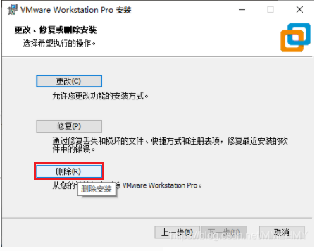
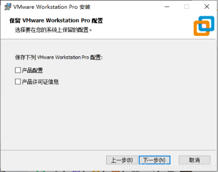
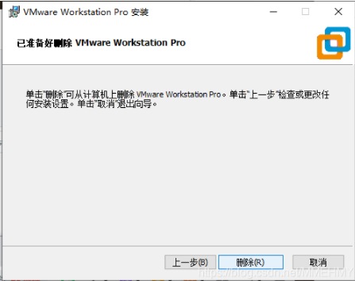
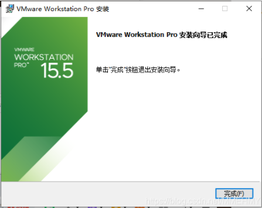
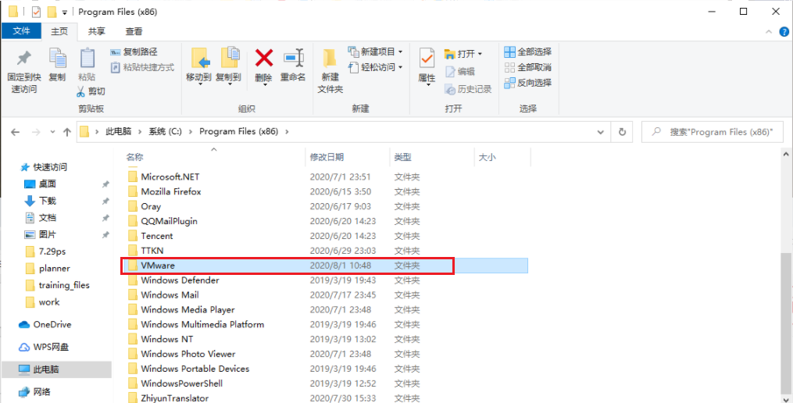
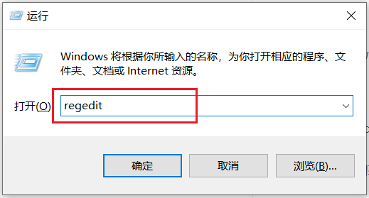
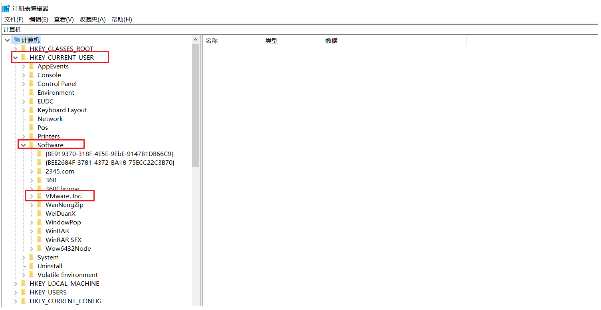
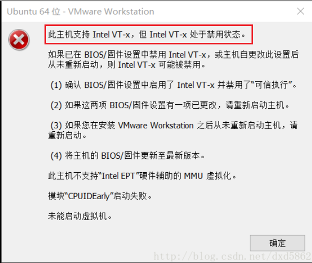
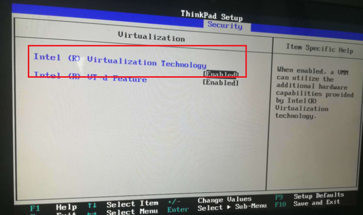

## Vmware虚拟机问题解决方案

### 1. 运行虚拟机系统蓝屏

可能的原因有两个: 

1). 虚拟机所在磁盘的空间不足 ; -------> 清理磁盘空间 。

2). 操作系统版本高, 需要适配新版本的Vmware ; ------> 卸载Vmware15版本, 安装Vmware16版本 。

### 2. 卸载Vmware步骤

**1). 卸载已经安装的VMware**

 

弹出确认框, 点击"下一步":

 

下一步之后, 选择删除:

 

选择下一步,继续删除:

 

点击 "删除" 按钮:

 

卸载完成: 

 

同时, 进入磁盘目录, 查看VMware 的安装目录, 查看文件夹是否为空:

 

退出到VMware这层目录, 右键删除"VMware"文件夹，删除完成:

 

**2). 清理注册表**

卸载Vmware之后, 一定一定要清理Vmware的注册表信息 ;

A. 按住Windows + R , 在弹出框中输入 "regedit" 调出注册表

 

 

B. 打开“HKEY_CURRENT_USER”文件夹，找到“Software”文件夹并打开

 

C. 找到“VMware.Inc”，右键删除

 

**3). 安装VMware16版本**

链接：https://pan.baidu.com/s/1P_W69FDeJphQUO1_X4PIFg 
提取码：zdpo 

下载16版本的软件, 并安装 ;

 

### 3. 运行虚拟机时报错VT-x

 

这个是由于英特尔的虚拟化技术, 没有开启, 需要进入系统的BIOS界面 , 开启英特尔的虚拟化技术 ; 不同的电脑型号 , 进入BIOS界面的方式不同, 需要百度查询一下自己电脑的型号 , 如何进BIOS ;

windows10系统可以参考: https://blog.csdn.net/biu_code/article/details/107504627

 

