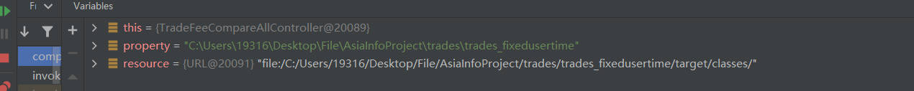

# 1.session和cookie的生命周期？

- 一般都是**一次会话**期间
- **持久化存储**
  - Cookie的默认有效期是20分钟。默认情况下，Cookie存储在浏览器内存中，当浏览器关闭，内存释放，则Cookie被销毁（生命周期一次会话期间）。可以通过setMaxAge()持久化存储（使Cookie不随着浏览器关闭而被销毁）
  - Session默认30分钟（默认值是在Tomcat的web.xml配置文件中写死的），这个失效时间，是可以通过配置进行修改的在项目的web.xml中配置）
    - 钝化：在服务器正常关闭后，Tomcat会自动将Session数据写入硬盘的文件中（服务器重启后，session数据会被保存）
    - 活化：再次启动服务器后，从文件中加载数据到Session中

---

- Cookie的原理分析

  对于Cookie的实现原理是基于HTTP协议的,其中设计到HTTP协议中的两个请求头信息:

  * 响应头:set-cookie
  * 请求头: cookie

  

  * 对于AServlet响应数据的时候，Tomcat服务器都是基于HTTP协议来响应数据
  * 当Tomcat发现后端要返回的是一个Cookie对象之后，Tomcat就会在响应头中添加一行数据==`Set-Cookie:username=zs`==
  * 浏览器获取到响应结果后，从响应头中就可以获取到`Set-Cookie`对应值`username=zs`,并将数据存储在浏览器的内存中
  * 浏览器再次发送请求给BServlet的时候，浏览器会自动在请求头中添加==`Cookie: username=zs`==发送给服务端BServlet
  * Request对象会把请求头中cookie对应的值封装成一个个Cookie对象，最终形成一个数组
  * BServlet通过Request对象获取到Cookie[]后，就可以从中获取自己需要的数据

- Session是基于Cookie实现的，Session是如何保证在一次会话中获取的Session对象是同一个呢?


(1)demo1在第一次获取session对象的时候，session对象会有一个唯一的标识，假如是`id:10`

(2)demo1在session中存入其他数据并处理完成所有业务后，需要通过Tomcat服务器响应结果给浏览器

(3)Tomcat服务器发现业务处理中使用了session对象，就会把session的唯一标识`id:10`当做一个cookie，添加`Set-Cookie:JESSIONID=10`到响应头中，并响应给浏览器

(4)浏览器接收到响应结果后，会把响应头中的coookie数据存储到浏览器的内存中

(5)浏览器在同一会话中访问demo2的时候，会把cookie中的数据按照`cookie: JESSIONID=10`的格式添加到请求头中并发送给服务器Tomcat

(6)demo2获取到请求后，从请求头中就读取cookie中的JSESSIONID值为10，然后就会到服务器内存中寻找`id:10`的session对象，如果找到了，就直接返回该对象，如果没有则新创建一个session对象

(7)关闭打开浏览器后，因为浏览器的cookie已被销毁，所以就没有JESSIONID的数据，服务端获取到的session就是一个全新的session对象

# 2.lambda+Stream

```java
List<DishFlavor> flavors = dishDto.getFlavors();
flavors = flavors.stream().map((item) -> {
    item.setDishId(dishId);
    return item;
}).collect(Collectors.toList());
```

Stream 执行流程:
 * ① Stream的实例化

   ```java
   flavors.stream()
   
   java.util.Collection<E> @Contract(pure = true) 
   public java.util.stream.Stream<E> stream()
   Returns a sequential Stream with this collection as its source.
   ```

 * ② 一系列的中间操作（过滤、映射、...)

   ```java
   .map((item) -> {
       item.setDishId(dishId);
       return item;
   })
        
   映射：
   //map(Function f)——接收一个函数作为参数，将元素转换成其他形式或提取信息，该函数会被应用到每个元素上，并将其映射成一个新的元素。
   public abstract <R> Stream<R> map(java.util.function.Function<? super T, ? extends R> mapper)
   Returns a stream consisting of the results of applying the given function to the elements of this stream.
   ```

 * ③ 终止操作

   ```java
   .collect(Collectors.toList());
   
   收集：
   //collect(Collector c)——将流转换为其他形式。接收一个 Collector接口的实现，用于给Stream中元素做汇总的方法
   ```

# 3.put delete有请求体？

- PUT有请求体
- delete无请求体

# 4.Dto交互

## 后端Dto接收数据

保存套餐信息

| 请求     | 说明         |
| -------- | ------------ |
| 请求方式 | POST         |
| 请求路径 | /setmeal     |
| 请求参数 | json格式数据 |

传递的json格式数据如下: 

```json
{
    "name":"营养超值工作餐",
    "categoryId":"1399923597874081794",
    "price":3800,
    "code":"",
    "image":"9cd7a80a-da54-4f46-bf33-af3576514cec.jpg",
    "description":"营养超值工作餐",
    "dishList":[],
    "status":1,
    "idType":"1399923597874081794",
    "setmealDishes":[
    	{"copies":2,"dishId":"1423329009705463809","name":"米饭","price":200},
    	{"copies":1,"dishId":"1423328152549109762","name":"可乐","price":500},
    	{"copies":1,"dishId":"1397853890262118402","name":"鱼香肉丝","price":3800}
    ]
}
```

```java
		/**
     * 新增套餐
     * @param setmealDto
     * @return
     */
    @PostMapping
    public R<String> save(@RequestBody SetmealDto setmealDto){
        log.info("套餐信息：{}",setmealDto);

        setmealService.saveWithDish(setmealDto);

        return R.success("新增套餐成功");
    }

/**
     * 新增套餐，同时需要保存套餐和菜品的关联关系
     * @param setmealDto
     */
    @Transactional
    public void saveWithDish(SetmealDto setmealDto) {
        //保存套餐的基本信息，操作setmeal，执行insert操作
        this.save(setmealDto);

        List<SetmealDish> setmealDishes = setmealDto.getSetmealDishes();
        setmealDishes.stream().map((item) -> {
            item.setSetmealId(setmealDto.getId());
            return item;
        }).collect(Collectors.toList());

        //保存套餐和菜品的关联信息，操作setmeal_dish,执行insert操作
        setmealDishService.saveBatch(setmealDishes);
    }
```

```java
@Data
public class SetmealDto extends Setmeal {

    private List<SetmealDish> setmealDishes;

    private String categoryName;
}
```

## 后端Dto返回数据

```java
/**
     * 根据条件查询对应的菜品数据
     * @param dish
     * @return
     */
    /*@GetMapping("/list")
    public R<List<Dish>> list(Dish dish){
        //构造查询条件
        LambdaQueryWrapper<Dish> queryWrapper = new LambdaQueryWrapper<>();
        queryWrapper.eq(dish.getCategoryId() != null ,Dish::getCategoryId,dish.getCategoryId());
        //添加条件，查询状态为1（起售状态）的菜品
        queryWrapper.eq(Dish::getStatus,1);

        //添加排序条件
        queryWrapper.orderByAsc(Dish::getSort).orderByDesc(Dish::getUpdateTime);

        List<Dish> list = dishService.list(queryWrapper);

        return R.success(list);
    }*/

    @GetMapping("/list")
    public R<List<DishDto>> list(Dish dish){
        //构造查询条件
        LambdaQueryWrapper<Dish> queryWrapper = new LambdaQueryWrapper<>();
        queryWrapper.eq(dish.getCategoryId() != null ,Dish::getCategoryId,dish.getCategoryId());
        //添加条件，查询状态为1（起售状态）的菜品
        queryWrapper.eq(Dish::getStatus,1);

        //添加排序条件
        queryWrapper.orderByAsc(Dish::getSort).orderByDesc(Dish::getUpdateTime);

        List<Dish> list = dishService.list(queryWrapper);

        List<DishDto> dishDtoList = list.stream().map((item) -> {
            DishDto dishDto = new DishDto();

            BeanUtils.copyProperties(item,dishDto);

            Long categoryId = item.getCategoryId();//分类id
            //根据id查询分类对象
            Category category = categoryService.getById(categoryId);

            if(category != null){
                String categoryName = category.getName();
                dishDto.setCategoryName(categoryName);
            }

            //当前菜品的id
            Long dishId = item.getId();
            LambdaQueryWrapper<DishFlavor> lambdaQueryWrapper = new LambdaQueryWrapper<>();
            lambdaQueryWrapper.eq(DishFlavor::getDishId,dishId);
            //SQL:select * from dish_flavor where dish_id = ?
            List<DishFlavor> dishFlavorList = dishFlavorService.list(lambdaQueryWrapper);
            dishDto.setFlavors(dishFlavorList);
            return dishDto;
        }).collect(Collectors.toList());

        return R.success(dishDtoList);
    }
```

```java
@Data
public class DishDto extends Dish {

    //菜品对应的口味数据
    private List<DishFlavor> flavors = new ArrayList<>();

    private String categoryName;

    private Integer copies;
}
```

# 5. 使用事物情况，添加@Transactional地方

- 多表一起增删改

# 6. mysql自增id无所谓的坑

https://blog.csdn.net/Seky_fei/article/details/107756788?spm=1001.2101.3001.6661.1&utm_medium=distribute.pc_relevant_t0.none-task-blog-2%7Edefault%7ECTRLIST%7ERate-1-107756788-blog-127441012.pc_relevant_multi_platform_whitelistv3&depth_1-utm_source=distribute.pc_relevant_t0.none-task-blog-2%7Edefault%7ECTRLIST%7ERate-1-107756788-blog-127441012.pc_relevant_multi_platform_whitelistv3&utm_relevant_index=1

https://www.cnblogs.com/unrealCat/p/16042181.html

- id自不自增完全没关系，id唯一的作用就是区分数据呗；他这个自增的id 不要改来改去的 没啥意思 你也不可能把信息放到这个里面
- 一般生成i可以放时间信息进去，这样一眼就知道这玩意是啥时候产生的

# 7.本地缓存技术了解

- 谷歌的guava，caffeine（性能更好）
- Spring Cache @Cacheable + Caffeine实现本地缓存
- 如果某些数据不需要共享访问那就可以放在本地，毕竟Redis再快也不可能比本地更快
- redis可以放在其他服务器上，谷歌缓存在项目运行的服务器上

# 8. MySQL字符集


```SQL
create database rw default charset utf8mb4;

use rw;

CREATE TABLE `user` (
  `id` int(11) NOT NULL AUTO_INCREMENT,
  `name` varchar(255) DEFAULT NULL,
  `age` int(11) DEFAULT NULL,
  `address` varchar(255) DEFAULT NULL,
  PRIMARY KEY (`id`)
) ENGINE=InnoDB DEFAULT CHARSET=utf8mb4;
```

- utf8mb4 -- UTF-8 Unicode和utf8 -- UTF-8 Unicode区别的整理

  https://blog.csdn.net/z947663039/article/details/84029573

  https://blog.csdn.net/themagickeyjianan/article/details/108790962

  - MySQL在5.5.3之后增加了这个utf8mb4的编码，mb4就是most bytes 4的意思，专门用来兼容四字节的[unicode](https://so.csdn.net/so/search?q=unicode&spm=1001.2101.3001.7020)。好在utf8mb4是utf8的超集，除了将编码改为utf8mb4外不需要做其他转换。当然，为了节省空间，一**般情况下使用utf8也就够了**。
  - 
  - 既然utf8应付日常使用完全没有问题，那为什么还要使用utf8mb4呢? 低版本的MySQL支持的utf8编码，最大字符长度为 3 字节，如果遇到 4 字节的字符就会出现错误了。
    - 在mysql中,utf8字符集下,一个中文汉字占3个字节数;如果是gbk字符集下,一个中文汉字占2个字节数
  - 那么utf8mb4比utf8多了什么的呢? 多了emoji编码支持.

- utf8mb4_unicode_ci、utf8mb4_general_ci的区别总结

  https://blog.csdn.net/weixin_45839894/article/details/128096805

  - utf8mb4_general_ci : 不区分大小写， utf8mb4_general_cs 区分大小写
    utf8mb4_bin : 将字符串每个字符串用二进制数据编译存储，区分大小写，而且可以存二进制的内容。
    utf8mb4_unicode_ci : 校对规则仅部分支持Unicode校对规则算法,一些字符还是不能支持；utf8mb4_unicode_ci不能完全支持组合的记号

  - `utf8mb4_general_ci `也适用德语、法语或者俄语，但会有不准。如果你的应用能够接受这些，那么应该使用 utf8mb4_general_ci，因为它速度快。否则，使用utf8mb4_unicode_ci，因为它比较准确。

    准确性：

    - utf8mb4_unicode_ci是基于标准的Unicode来排序和比较，能够在各种语言之间精确排序
    - utf8mb4_general_ci没有实现Unicode排序规则，在遇到某些特殊语言或者字符集，排序结果可能不一致。

# 9. 字符集 字符编码是什么

当一个人说「Unicode」，他指的是那一份行业标准。当一个人说「UTF-8」，他指的是那一套编码方案。

https://www.jianshu.com/p/bd7a6c508c33

- 字符集：某个符号和某个数字映射关系的一个表。来进行字符编码。常见字符集有ASCII字符集、GBXXX字符集、Unicode字符集等

  - GBXXX字符集：

    GBK：最常用的中文码表。是在GB2312标准基础上的扩展**规范**，使用了双字节编码方案，共收录了21003个汉字，完全兼容GB2312标准，同时支持繁体汉字以及日韩汉字等

  - Unicode字符集

- 字符编码是把字符集中的字符编码为特定的二进制数，以便在计算机中存储。

  - UTF-8编码：Unicode对应的一种编码。它使用一至四个字节为每个字符编码

    编码规则：

    128个US-ASCII字符，只需一个字节编码

    拉丁文等字符，需要二个字节编码

    大部分常用字（含中文），使用三个字节编码

    其他极少使用的Unicode辅助字符，使用四字节编码

- 字符集和字符编码一般都是成对出现的，如ASCII、IOS-8859-1、GB2312、GBK，都是即表示了字符集又表示了对应的字符编码，以后统称为编码。Unicode比较特殊

# 10.Mysql useSSL=false

- jdbc:mysql://Localhost:3306/cLoud_order?useSSL=false
- SSL(Secure Sockets Layer 安全套接字协议)，在mysql进行连接的时候,如果mysql的版本是5.7之后的版本必须要加上useSSL=false,mysql5.7以及之前的版本则不用进行添加useSSL=false，会默认为false，一般情况下都是使用useSSL=false，尤其是在将项目部署到linux上时，一定要使用useSSL=false！！！，useSSL=true是进行安全验证，一般通过证书或者令牌什么的，useSSL=false就是通过账号密码进行连接，通常使用useSSL=false！！！
- SSL协议提供服务主要：
  1）认证用户服务器，确保数据发送到正确的服务器；
  2）加密数据，防止数据传输途中被窃取使用；
  3）维护数据完整性，验证数据在传输过程中是否丢失；

# 11. 回送地址127.0.0.1&80端口

- 回送地址127.0.0.1，本地默认ip
- 80端口，默认访问端口

# 12. Spring与redis相关的技术概念

## Spring Data Redis 

Spring Data Redis 是 Spring 的一部分，提供了在 Spring 应用中通过简单的配置就可以访问 Redis 服务，对 Redis 底层开发包进行了高度封装。在 Spring 项目中，可以使用Spring Data Redis来简化 Redis 操作。

Spring **对 Redis 客户端进行了整合**（比如jedis），提供了 Spring Data Redis，在Spring Boot项目中还提供了对应的Starter，即 **spring-boot-starter-data-redis**。

Spring Data Redis中提供了一个高度封装的类：**RedisTemplate**，针对 Jedis 客户端中大量api进行了归类封装,将同一类型操作封装为operation接口，具体分类如下：

- ValueOperations：简单K-V操作
- SetOperations：set类型数据操作
- ZSetOperations：zset类型数据操作
- HashOperations：针对hash类型的数据操作
- ListOperations：针对list类型的数据操作

## SpringCache

**Spring Cache**是一个框架，实现了**基于注解的缓存功能**，只需要简单地加一个注解，就能实现缓存功能，大大简化我们在业务中操作缓存的代码。

Spring Cache只是提供了一层抽象，底层可以切换不同的cache实现。具体就是通过**CacheManager**接口来统一不同的缓存技术。CacheManager是Spring提供的各种缓存技术抽象接口。

针对不同的缓存技术需要实现不同的CacheManager：

| **CacheManager**    | **描述**                           |
| ------------------- | ---------------------------------- |
| EhCacheCacheManager | 使用EhCache作为缓存技术            |
| GuavaCacheManager   | 使用Google的GuavaCache作为缓存技术 |
| RedisCacheManager   | 使用Redis作为缓存技术              |

在SpringCache中提供了很多缓存操作的注解，常见的是以下的几个：

| **注解**       | **说明**                                                     |
| -------------- | ------------------------------------------------------------ |
| @EnableCaching | 开启缓存注解功能                                             |
| @Cacheable     | 在方法执行前spring先查看缓存中是否有数据，如果有数据，则直接返回缓存数据；若没有数据，调用方法并将方法返回值放到缓存中 |
| @CachePut      | 将方法的返回值放到缓存中                                     |
| @CacheEvict    | 将一条或多条数据从缓存中删除                                 |

在spring boot项目中，使用缓存技术只需在项目中导入相关缓存技术的依赖包，并在启动类上使用@EnableCaching开启缓存支持即可。

例如，使用Redis作为缓存技术，只需要导入**Spring data Redis**的maven坐标即可。

# 13. Path环境变量&JAVA_HOME

## Path环境变量

**path用于记住程序路径，方便在命令行窗口的任意目录启动程序。**

- 前面我们使用过JDK的bin目录下的javac和java命令，为什么我们能够直接使用呢？这里我们来讲解一下原理。而要讲解这个原理，我们就不得不提一下Path环境变量。
- **Path环境变量的作用：**
  - 它提供了windows命令行中指令的可执行文件(比如：.exe文件)路径，让我们在命令行中输入命令时，能够找到对应的可执行文件执行
  - 简单说：让命令在命令行中使用有效
  - windows有一种运行机制：当前执行的程序在当前目录中如果不存在时，就会在系统中一个名为path的环境变量指定的目录中寻找
- 比如：
  - 在Path环境变量中配置QQ软件的命令行方式启动
  - C:\Program Files (x86)\Tencent\QQ\Bin
  - 配置完毕之后，我们到DOS窗口中，通过“qq”指令，就可以启动QQ软件了。
- 我们把.exe文件所在的路径配置到Path环境变量中，就可以使用.exe结尾的指令来启动程序了。

## JAVA_HOME

- JAVA_HOME是为其他需要调用JDK的软件使用的。JAVA_HOME是一个约定，当其他软件需要JDK路径时，多数会默认从环境变量中提取JAVA_HOME这个变量，因此他被设置为JDK的路径。
- 告诉操作系统JDK安装在了哪个位置（ 将来其他技术要通过这个环境变量找到JDK ）
  注意：较新版的JDK只是自动配置了Path，没有自动配置JAVA_HOME。

# 14. 获取文件的相对路径

- 获取未编译文件的相对路径

- ```java
  String property = System.getProperty("user.dir");
  //URL resource = this.getClass().getResource("/");
  String resourcesPath property = property + "\\src\\main\\resources";
  File dataFile = new File(resourcesPath+"\\data\\data.txt");
  ```

  

- String property = System.getProperty("user.dir");
  URL resource = this.getClass().getResource("/");

因为用resource获取的是编译过的路径，实际上一般用property编译前的路径（为了修改查看获取的文件更方便)

# 15.分布式、微服务、SOA

- https://blog.csdn.net/weixin_43143432/article/details/125637320

- **分布式架构**（部署角度）

  - 把不同服务部署在不同服务器上。
  - 相对于单体架构：将业务的所有功能集中在一个项目中开发，打成一个包部署。

- 微服务

  - 是一种经过良好架构设计的**分布式架构方案** 。
  - 维基上对其定义为：一种软件开发技术- 面向服务的体系结构（SOA）架构样式的一种变体。它提倡将单一应用程序划分成一组小的服务，服务之间互相协调、互相配合，为用户提供最终价值。每个服务运行在其独立的进程中，服务与服务间采用轻量级的通信机制互相沟通。
  - 服务组件化
    使用REST API交互
  - 进一步降低服务之间的耦合度，提供服务的独立性和灵活性。做到高内聚，低耦合。

  - SpringCloud是目前国内使用最广泛的微服务框架。SpringCloud集成了各种微服务功能组件，并基于SpringBoot实现了这些组件的自动装配，从而提供了良好的开箱即用体验

- SOA架构（服务角度）

  - 面向服务的架构（Service-Oriented-Architecture），又叫服务治理。将应用程序的不同功能单元（称为服务）进行拆分，并通过接口协议来完成服务间通信。服务间通过RPC远程控制 进行远程调用
  - 目前Dubbo在企业中有两种开发思路
    - 基于SOA思想
      将传统单一应用拆分为web（消费者）模块和service（提供者）模块，基于Dubbo通信
    - 辅助SpringCloud架构提升效率
      Dubbo基于TCP（传输层）协议，效率更高。可以替换Feign，提升高并发压力

- 集群

  - 同时存在一个服务的多个实例

简单来说，分布式系统是指将一个大型系统分割成若干个子系统部署在不同的机器上，通过网络通信协作完成某个任务；而微服务是一种架构风格，是指将一个大型的、复杂的系统划分成多个小的、独立的服务单元，每个服务单元都可以独立开发、部署和升级，通过轻量级通信机制来实现服务之间的协作。

举个例子，我们可以把一个电商系统看作一个分布式系统，该系统包含了订单管理、支付、库存管理、用户管理等多个子系统，每个子系统都可以独立部署在不同的服务器上，并通过网络通信来协同工作。在这个系统中，如果我们将订单管理子系统划分为多个微服务单元，例如查询订单、创建订单、取消订单等，每个微服务单元都可以独立开发、部署和升级，并通过轻量级的通信机制（如RESTful API）来实现服务之间的协作，那么这个系统就可以被看作是一个基于微服务架构的分布式系统。

分布式是一种架构模式，通过将系统拆分成多个独立的部分并在网络上分布这些部分，从而实现系统的协同工作。分布式系统的主要目标是提高系统的性能、可靠性和可伸缩性。

而微服务是一种特定的分布式架构风格，它将应用程序拆分成一组较小的、独立的服务单元，这些单元在组织上是自治的，可以独立部署、升级和扩展。微服务的主要目标是提高应用程序的灵活性、可维护性和可扩展性。

因此，可以说微服务是一种基于分布式架构的一种设计风格，它是分布式架构的一种具体实现方式。

举个例子来说，分布式就像是把一个大的工程拆分成多个子系统，每个子系统都有独立的模块和服务，但是这些子系统仍然需要通过网络进行协同工作。而微服务则是在分布式基础上更进一步，将每个子系统拆分成更小的、独立的服务单元，每个服务单元都有自己的数据存储和服务接口，这样可以更加灵活地管理和扩展系统。


# 16.SpringBoot、SpringMVC，Spring

- Spring发展到今天已经形成了一种开发的生态圈，Spring提供了若干个项目，每个项目用于完成特定的功能。

- Spring Framework是Spring生态圈中最基础的项目，是其他项目的根基：容器IOC，DI，AOP，事务

  - IOC（Inversion of Control）控制反转

    - 使用对象时，由主动new产生对象转换为由外部提供对象，此过程中对象创建控制权由程序转移到外部，此思想称为控制反转。通俗的讲就是“将new对象的权利交给Spring，我们从Spring中获取对象使用即可”
    - Spring技术对IOC思想进行了实现

    - Spring提供了一个容器，称为IOC容器，用来充当IoC思想中的“外部”
    - IOC容器负责对象的创建、初始化等一系列工作，被创建或被管理的对象在IoC容器中统称为Bean

  - DI（Dependency Injection）依赖注入

    - 在容器中建立bean与bean之间的依赖关系的整个过程，称为依赖注入。

  - AOP(Aspect Oriented Programming)面向切面编程，一种编程范式，指导开发者如何组织程序结构

    - 作用：在不惊动原始设计的基础上为其进行功能增强。简单的说就是在不改变方法源代码的基础上对方法进行功能增强。
    - Spring理念：无入侵式/无侵入式

- Spring是IOC和AOP的容器框架，SpringMVC是基于Spring功能之上添加的Web框架，想用SpringMVC必须先依赖Spring。

- SpringBoot是由Pivotal团队提供的全新框架，其设计目的是用来简化Spring应用的初始搭建以及开发过程。**Spring Boot实现了自动配置，降低了项目搭建的复杂度**。它主要是为了解决使用Spring框架需要进行大量的配置太麻烦的问题，所以它并不是用来替代Spring的解决方案，而是和Spring框架紧密结合用于提升Spring开发者体验的工具。同时它集成了大量常用的第三方库配置(例如Jackson, JDBC, Mongo, Redis, Mail等等)，Spring Boot应用中这些第三方库几乎可以零配置的开箱即用(out-of-the-box)。Spring Boot只是承载者，辅助你简化项目搭建过程的。**如果承载的是WEB项目，使用Spring MVC作为MVC框架**，那么工作流程和你上面描述的是完全一样的，因为这部分工作是Spring MVC做的而不是Spring Boot。

# 17.上下文

- CPU当时的一些信息，计数器 程序指针 寄存器的一些信息；上下文里面放的是进程执行的时候的一些关键信息
- 缓存是缓存的数据，应用本身的数据

# 18. 响应式编程

https://www.jianshu.com/p/25ca48148780

贾老师的理解：

- 响应式编程就是换了个编程模式，更关注数据的变动
- 代码每一步都是接着处理上一步的结果，等待上一步响应之后继续处理
- 我觉得本质上就是异步处理，他可能不需要上一步完全执行完就能走下一步，你来多少数据我处理多少

http://www.manongjc.com/detail/51-buijxurofdxbcok.html

响应式编程是一种新的编程风格，它提供了一种基于事件驱动的方式来处理异步数据流的能力，其特点是允许开发人员构建事件驱动、可扩展性、弹性的响应式系统。

响应式编程遵循观察者设计模式，该模式可以定义为：当一个事物发生状态变化时，其他事物将被相应地通知和更新。 因此，观察者不需要轮询事件的变化，而是异步等待事件变化的通知，所以观察者收到通知后就可以处理该事件。 在这个过程中，观察者是发生事件变化时执行的函数，而数据流是可以被观察到的实际可观测数据，也就是被观察者或者称作主题。

https://blog.csdn.net/m0_53614495/article/details/126945841

响应式的本质是对变量的监听，当监听到变量发生变化时，我们可以做一些预定义的逻辑。例如对于数据绑定技术来说，需要做的是在变量发生改变时及对页面的元素进行刷新。

# 19. starter有什么好处

- SpringBoot中常见项目名称，定义了当前项目使用的所有项目坐标，以达到减少依赖配置的目的

在Spring Boot中，Starter是一种特殊的依赖关系，它封装了一组常用的、相关联的库和框架的依赖，以方便开发者快速集成和使用这些库和框架，并且保证它们之间的依赖关系的正确性。

Spring Boot提供了很多内置的Starter，如spring-boot-starter-web、spring-boot-starter-data-jpa等，它们都封装了一组常用库和框架的依赖，如Spring MVC、Tomcat、Hibernate等。

使用Spring Boot的Starter可以让开发者更加便捷地搭建项目框架、配置环境，减少代码冗余，提高代码可复用性。例如，如果你需要构建一个Web应用程序，只需添加spring-boot-starter-web依赖，Spring Boot会自动引入所有必要的库和框架，无需手动配置。

同时，Spring Boot的Starter还具有版本管理的功能，即它们已经预定义了一组最新的、相互兼容的库和框架依赖，可以避免因版本不一致而导致的问题。 在实际开发中，使用Spring Boot的Starter可以大幅度减少开发者的工作量和大量配置，提高开发效率和代码质量。


作者：黑白键v
链接：https://www.zhihu.com/question/589230490/answer/2933994198

# 20. Dependencies、Libraries、函数库的区别

- Dependencies - 依赖 ， Libraries - 库；都是引用的，java里面统一都是引入jar包（不用纠结）
- 函数库是C语言的范畴

# 21. Shell、Bash

Shell 脚本（shell script），是一种为 shell 编写的脚本程序。

Bash，也就是 Bourne Again Shell（易用且免费），Bash 在日常工作中被广泛使用。同时，Bash 也是大多数 Linux 系统默认的 Shell。

# 22. http长链接、短链接

https://blog.csdn.net/linkingfei/article/details/105915233

在HTTP/1.0中，默认使用的是**短连接**。也就是说，浏览器和服务器每进行一次HTTP操作，就建立一次连接，但任务结束就中断连接。如果客户端浏览器访问的某个HTML或其他类型的 Web页中包含有其他的Web资源，如JavaScript文件、图像文件、CSS文件等；当浏览器每遇到这样一个Web资源，就会建立一个HTTP会话。

但从 HTTP/1.1起，默认使用**长连接**，用以保持连接特性。使用长连接的HTTP协议，会在响应头有加入这行代码：Connection:keep-alive在使用长连接的情况下，当一个网页打开完成后，客户端和服务器之间用于传输HTTP数据的 TCP连接不会关闭，如果客户端再次访问这个服务器上的网页，会继续使用这一条已经建立的连接。Keep-Alive不会永久保持连接，它有一个保持时间，可以在不同的服务器软件（如Apache）中设定这个时间。实现长连接要客户端和服务端都支持长连接。

HTTP协议的长连接和短连接，实质上是TCP协议的长连接和短连接。

http1.1是目前最为主流的http协议版本。

# 23.注册中心 长链接、短链接

1. nacos使用的是netty和服务直接进行连接,属于长连接
2. eureka是使用定时发送和服务进行联系,属于短连接

https://www.itshiye.com/07/1986.html

https://blog.csdn.net/qq_57756904/article/details/128401138

nacos是和服务器直连的，所以一直保持着链接；Eureka相当于每次找服务的时候发个请求吧。

# 24.过滤器和拦截器

https://www.cnblogs.com/panxuejun/p/7715917.html

- 过滤器Filter基于Servlet实现，拦截器是SpringMVC中实现的一种基于Java反射（动态代理）机制的方法增强工具

- 实际开发中，拦截器的应用场景会比过滤器要更多，下面是拦截器和过滤器的主要应用场景：
  - **拦截器的应用场景**：权限控制，日志打印，参数校验
  - **过滤器的应用场景**：跨域问题解决，编码转换


# 25. Servlet和SpringMVC

https://blog.csdn.net/fengwuJ/article/details/122998409

- SpringMVC，基于MVC架构，提供了模型-视图-控制的体系结构和灵活、松散耦合的 web 应用程序的组件；对Servlet进行封装、整合、管理；
- Servlet 是运行在 Web 服务器或应用服务器上的程序，它是作为来自 Web 浏览器或其他 HTTP 客户端的请求和 HTTP 服务器上的数据库或应用程序之间的中间层。使用 Servlet，您可以收集来自网页表单的用户输入，呈现来自数据库或者其他源的记录，还可以动态创建网页。
  

# 26. socket和servlet

https://blog.csdn.net/codekitty/article/details/107577816

- Socket是用于网络通信的接口，如：通过socket上的tcp\ip协议、udp协议通信
- servlet则是运行在web容器里的程序，接收http传来的请求和响应该请求。是在编写Java web的以Template来表示的一个接口规范。使用HTTP协议在服务器与客户端之间通信（处理request和response）的技术。它不建立连接，属于应用层，是socket的一种应用。

# 27. 网络协议对应的模型层

OSI七层网络模型：

WEB使用HTTP协议作应用层协议，以封装HTTP 文本信息，然后使用TCP/IP做传输层协议将它发到网络上。

# 28.判断各种类型数据是否为空

```java
            if(!StringUtils.isEmpty(info.getGender())) {
//StringUtils pringframework
```

# 29.BeanUtils

springframework提供

```java
BeanUtils.copyProperties(userInfo,vo);
```

# 30.快速循环集合

```java
map.forEach((k,v)->System.out.println(k+"--"+V));
```

# 31.基于List实现分页Stream流处理

```java
 List<Long> pids = Arrays.stream(values).skip((page - 1) * pagesize).limit(pagesize)
                        .map(e->Long.valueOf(e))
                        .collect(Collectors.toList());
```

# 32.MongoDB获取随机数

Mongo随机获取多条数据

Aggregation.sample()设置随机采样数
aggregate()方法统计

```java
//随机查询多条数据
    public List<Movement> randomMovements(Integer counts) {
        //1、创建统计对象，设置统计参数 解析数据库表
        TypedAggregation aggregation = Aggregation.newAggregation(Movement.class,Aggregation.sample(counts));
        //2、调用mongoTemplate方法统计 将数据设置到对象中
        AggregationResults<Movement> results = mongoTemplate.aggregate(aggregation, Movement.class);
        //3、获取统计结果
        return results.getMappedResults();
    }
```

# 33.前后端联调

- 前端处理不了返回值null，需要构建空的对象

# 34.1Netty、Http

即时通讯：不用http，用netty，高性能，非阻塞的nNettyio服务器

- Http和Netty对比：

  HTTP 和 Netty 是两个不同的概念，无法直接进行优劣对比。HTTP 是一种**应用层网络协议**，用于在 Web 上进行超文本传输，而 Netty 是一款基于 Java 的**高性能网络通信框架**。

  HTTP 的优点包括简单、灵活、易于使用和广泛应用于 Web 等领域。它具有良好的互操作性，支持广泛的客户端和服务器平台，是 Web 浏览器和 Web 服务器之间的主要通信协议。

  Netty 是一款开源的高性能网络通信框架，提供了基于 NIO（Non-blocking I/O）的异步事件驱动模型，具有出色的性能和可扩展性。Netty 可以用于构建各种类型的网络应用，如服务器、客户端、代理、网关等。它的优点包括高性能、异步非阻塞、可扩展性、灵活性、**对多种协议的支持**等。

  在比较 HTTP 和 Netty 时，可以考虑以下几个方面：

  1. 性能：Netty 是一款高性能的网络通信框架，适用于需要处理大量并发连接和高吞吐量的场景，而 HTTP 作为应用层协议，性能相对较低，受限于网络传输和协议本身的特点。
  2. 灵活性：HTTP 是一种应用层协议，其规范和约束较多，使用相对固定的请求和响应格式。而 Netty 提供了更灵活的网络通信框架，**可以自定义协议**和处理逻辑，适用于更复杂和定制化的网络应用。
  3. 使用场景：HTTP 主要用于 Web 页面的加载、数据传输、API 调用等场景，适用于广泛的 Web 应用开发。而 Netty 则适用于构建各种类型的网络应用，包括服务器、客户端、代理、网关等。
  4. 编程复杂性：HTTP 的使用相对简单，基于请求-响应模型，容易理解和使用。而 Netty 是一款较为底层的网络通信框架，使用较复杂，需要一定的网络编程经验和技能。

  综合而言，HTTP 和 Netty 都有各自的优点和适用场景。HTTP 适用于广泛的 Web 应用开发场景，而 Netty 则适用于需要高性能、灵活性和可扩展性的网络应用。选择使用哪种技术取决于具体的应用需求和开发团队的技术栈和经验。

- Netty使用Http吗？

  是的，Netty 可以用于实现 HTTP 协议的网络通信。虽然 Netty 是一款通用的网络通信框架，但它也可以用于实现 HTTP 协议的客户端和服务器端。在 Netty 中，可以通过编写自定义的 ChannelHandler 来处理 HTTP 请求和响应，从而实现 HTTP 通信。

  Netty 提供了一些与 HTTP 相关的编解码器和处理器，例如 `HttpRequestDecoder`、`HttpResponseEncoder`、`HttpObjectAggregator` 等，可以帮助处理 HTTP 协议的数据解析和编码。同时，Netty 的异步非阻塞的特性也使得它在处理大量并发连接和高吞吐量的 HTTP 通信场景中表现出色。

  通过使用 Netty，可以轻松构建高性能的 HTTP 服务器和客户端，实现各种类型的 Web 应用开发，包括 RESTful API、Web 服务、代理服务器等。同时，Netty 也提供了灵活的 API 和自定义扩展点，使得开发者可以根据实际需求自定义处理逻辑，从而满足特定的应用需求。

# 34.2 RPC、Http

https://mp.weixin.qq.com/s/vDYePLV4P2bsJJVMR1na9g

- HTTP和RPC都是常用的协议。HTTP协议是一种基于请求和响应模式的协议，用于在Web上进行数据传输。而RPC协议则是远程过程调用协议，它允许一个程序在另一个计算机上执行函数。
- RPC优点：
  - 更高的性能：RPC协议通常使用二进制协议进行数据传输，相对于HTTP的文本协议，具有更高的性能。此外，RPC协议通常使用连接池等技术来减少连接建立和断开的开销，提高性能。
  - 更严格的类型检查：RPC协议通常使用IDL（Interface Definition Language）来定义接口，可以进行更严格的类型检查。这有助于提高代码的可靠性和可维护性。
  - 更好的语义：RPC协议通常使用方法调用的语义，更符合面向对象编程的思想。相对于HTTP的请求和响应模式，更易于理解和使用。
  - 更安全的传输：RPC协议通常使用TLS等加密协议来保证数据传输的安全性。
- RPC的适用场景主要包括：
  1. 微服务架构：RPC协议可以用于微服务架构中的服务间通信，通过RPC调用其他服务的接口实现功能。
  2. 分布式系统：RPC协议可以用于分布式系统中，通过RPC调用其他节点上的函数实现分布式计算。
  3. 高并发场景：RPC协议通常使用连接池等技术来提高性能，适用于高并发场景。
  4. 多语言环境：RPC协议可以用于不同编程语言之间的通信，实现跨语言调用。
- Apache Thrift是一种高性能、跨语言的RPC框架，由Facebook开源。它支持多种编程语言，包括C++、Java、Python、PHP、Ruby等，可以实现不同语言之间的通信。下面是Apache Thrift的详细介绍
- Dubbo使用了RPC（远程过程调用）协议来实现不同进程之间的通信。Dubbo支持多种RPC框架，包括Dubbo协议、HTTP、Hessian、Thrift等。通过使用RPC协议，Dubbo可以将不同语言、不同平台的服务无缝地集成到一起，实现分布式服务的调用和管理。Dubbo3 提供了 Triple(Dubbo3)、Dubbo2 协议，这是 Dubbo 框架的原生协议。

# 35.序列Serializable和serialVersionUID

https://blog.csdn.net/zhangsann_6/article/details/119209371

```java
public class Friend implements java.io.Serializable{
    private static final long serialVersionUID = 6003135946820874230L;
```

- Serializable是Java提供的通用数据保存、读取和传输的接口。

- 应用场景：

  当我们需要把对象的状态信息:

  - A 通过网络进行传输（用套接字在网络上传送）
  - B 需要将对象的状态信息持久化（写入硬盘）

  以便将来使用时都需要把对象进行序列化

- 在Java中，serialVersionUID是一个用于实现序列化和反序列化的唯一标识符。它是一个long类型的静态变量，用于在对象序列化时确定对象的版本。

  当我们对一个Java对象进行序列化（将对象转换为字节流）时，serialVersionUID会被写入序列化流中，以便在反序列化（将字节流转换为对象）时进行比较。如果反序列化的字节流中的serialVersionUID与当前类中的serialVersionUID不匹配，那么反序列化操作将失败，并抛出一个InvalidClassException异常。

  因此，serialVersionUID的作用是保证在对象的序列化和反序列化过程中的版本一致性，确保程序的正常运行。如果我们不指定serialVersionUID，Java会根据对象的结构自动生成一个，但是这样可能会导致在反序列化时版本不一致的问题。因此，最好显式地指定serialVersionUID。

# 36.Redis使用情况

- 使用Redis缓存提高查询效率。对于喜欢/不喜欢功能，使用Redis中的set进行存储。Redis 的 Set 是无序集合。集合成员是唯一的，这就意味着集合中不能出现重复的数据。使用Set可以方便的实现交集，并集等个性化查询。（对于不多的数据需要进行交集并集的计算。可以使用redis set的特性）

# 37. Ribbon、Feign

- Ribbon和Feign都是Spring Cloud中用于实现服务间通信的框架，它们都可以通过负载均衡和服务发现等机制实现微服务之间的调用。Ribbon和Feign都是基于HTTP协议实现的客户端负载均衡和服务调用的工具。

- Ribbon是一个客户端负载均衡器，它通过在客户端内部进行负载均衡，从而使得服务间的通信更加高效。而Feign则是一个声明式的REST客户端（类似于定义接口的方式来调用REST服务，在Feign中，开发人员只需要定义接口和接口中的方法，Feign会自动将这些接口方法映射成HTTP请求，并且自动地将请求发送到相应的服务端。）

  它提供了基于注解的方法调用方式，使得调用远程服务的代码更加简洁。使用Feign，我们可以在接口上添加注解来定义服务调用，而无需手动处理HTTP请求和响应，从而减少了重复的代码和样板代码。

- Ribbon需要手动编写代码进行调用，需要开发人员自行处理与服务发现的交互，包括服务列表的拉取、负载均衡策略的选择等。而Feign则可以自动集成Eureka或者Consul等服务发现组件，避免了手动编写服务调用的繁琐流程。

- 在使用上，如果需要对请求进行更加精细的控制，比如超时时间的设置、请求拦截器的使用等，Ribbon提供了更多的自定义选项。而Feign则更加适合于简单的REST API调用，使用起来更加便捷。

综上所述，Ribbon更适用于需要手动控制负载均衡、需要进行高度定制的场景，而Feign则更适合于简单的REST API调用以及自动集成服务发现的场景。
