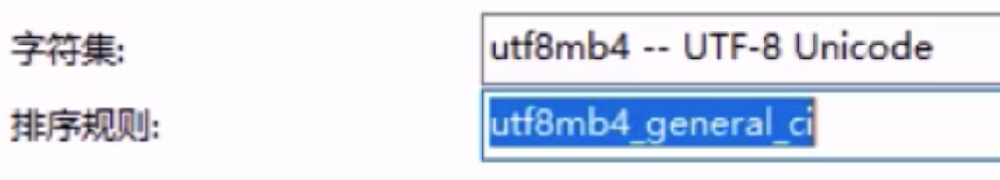

# 1.session和cookie的生命周期？

- 一般都是**一次会话**期间
- **持久化存储**
  - Cookie的默认有效期是20分钟。默认情况下，Cookie存储在浏览器内存中，当浏览器关闭，内存释放，则Cookie被销毁（生命周期一次会话期间）。可以通过setMaxAge()持久化存储（使Cookie不随着浏览器关闭而被销毁）
  - Session默认30分钟（默认值是在Tomcat的web.xml配置文件中写死的），这个失效时间，是可以通过配置进行修改的在项目的web.xml中配置）
    - 钝化：在服务器正常关闭后，Tomcat会自动将Session数据写入硬盘的文件中（服务器重启后，session数据会被保存）
    - 活化：再次启动服务器后，从文件中加载数据到Session中

---

- Cookie的原理分析

  对于Cookie的实现原理是基于HTTP协议的,其中设计到HTTP协议中的两个请求头信息:

  * 响应头:set-cookie
  * 请求头: cookie

  

  * 对于AServlet响应数据的时候，Tomcat服务器都是基于HTTP协议来响应数据
  * 当Tomcat发现后端要返回的是一个Cookie对象之后，Tomcat就会在响应头中添加一行数据==`Set-Cookie:username=zs`==
  * 浏览器获取到响应结果后，从响应头中就可以获取到`Set-Cookie`对应值`username=zs`,并将数据存储在浏览器的内存中
  * 浏览器再次发送请求给BServlet的时候，浏览器会自动在请求头中添加==`Cookie: username=zs`==发送给服务端BServlet
  * Request对象会把请求头中cookie对应的值封装成一个个Cookie对象，最终形成一个数组
  * BServlet通过Request对象获取到Cookie[]后，就可以从中获取自己需要的数据

- Session是基于Cookie实现的，Session是如何保证在一次会话中获取的Session对象是同一个呢?


(1)demo1在第一次获取session对象的时候，session对象会有一个唯一的标识，假如是`id:10`

(2)demo1在session中存入其他数据并处理完成所有业务后，需要通过Tomcat服务器响应结果给浏览器

(3)Tomcat服务器发现业务处理中使用了session对象，就会把session的唯一标识`id:10`当做一个cookie，添加`Set-Cookie:JESSIONID=10`到响应头中，并响应给浏览器

(4)浏览器接收到响应结果后，会把响应头中的coookie数据存储到浏览器的内存中

(5)浏览器在同一会话中访问demo2的时候，会把cookie中的数据按照`cookie: JESSIONID=10`的格式添加到请求头中并发送给服务器Tomcat

(6)demo2获取到请求后，从请求头中就读取cookie中的JSESSIONID值为10，然后就会到服务器内存中寻找`id:10`的session对象，如果找到了，就直接返回该对象，如果没有则新创建一个session对象

(7)关闭打开浏览器后，因为浏览器的cookie已被销毁，所以就没有JESSIONID的数据，服务端获取到的session就是一个全新的session对象

# 2.lambda+Stream

```java
List<DishFlavor> flavors = dishDto.getFlavors();
flavors = flavors.stream().map((item) -> {
    item.setDishId(dishId);
    return item;
}).collect(Collectors.toList());
```

Stream 执行流程:
 * ① Stream的实例化

   ```java
   flavors.stream()
   
   java.util.Collection<E> @Contract(pure = true) 
   public java.util.stream.Stream<E> stream()
   Returns a sequential Stream with this collection as its source.
   ```

 * ② 一系列的中间操作（过滤、映射、...)

   ```java
   .map((item) -> {
       item.setDishId(dishId);
       return item;
   })
        
   映射：
   //map(Function f)——接收一个函数作为参数，将元素转换成其他形式或提取信息，该函数会被应用到每个元素上，并将其映射成一个新的元素。
   public abstract <R> Stream<R> map(java.util.function.Function<? super T, ? extends R> mapper)
   Returns a stream consisting of the results of applying the given function to the elements of this stream.
   ```

 * ③ 终止操作

   ```java
   .collect(Collectors.toList());
   
   收集：
   //collect(Collector c)——将流转换为其他形式。接收一个 Collector接口的实现，用于给Stream中元素做汇总的方法
   ```

# 3.put delete有请求体？

- PUT有请求体
- delete无请求体

# 4.Dto交互

## 后端Dto接收数据

保存套餐信息

| 请求     | 说明         |
| -------- | ------------ |
| 请求方式 | POST         |
| 请求路径 | /setmeal     |
| 请求参数 | json格式数据 |

传递的json格式数据如下: 

```json
{
    "name":"营养超值工作餐",
    "categoryId":"1399923597874081794",
    "price":3800,
    "code":"",
    "image":"9cd7a80a-da54-4f46-bf33-af3576514cec.jpg",
    "description":"营养超值工作餐",
    "dishList":[],
    "status":1,
    "idType":"1399923597874081794",
    "setmealDishes":[
    	{"copies":2,"dishId":"1423329009705463809","name":"米饭","price":200},
    	{"copies":1,"dishId":"1423328152549109762","name":"可乐","price":500},
    	{"copies":1,"dishId":"1397853890262118402","name":"鱼香肉丝","price":3800}
    ]
}
```

```java
		/**
     * 新增套餐
     * @param setmealDto
     * @return
     */
    @PostMapping
    public R<String> save(@RequestBody SetmealDto setmealDto){
        log.info("套餐信息：{}",setmealDto);

        setmealService.saveWithDish(setmealDto);

        return R.success("新增套餐成功");
    }

/**
     * 新增套餐，同时需要保存套餐和菜品的关联关系
     * @param setmealDto
     */
    @Transactional
    public void saveWithDish(SetmealDto setmealDto) {
        //保存套餐的基本信息，操作setmeal，执行insert操作
        this.save(setmealDto);

        List<SetmealDish> setmealDishes = setmealDto.getSetmealDishes();
        setmealDishes.stream().map((item) -> {
            item.setSetmealId(setmealDto.getId());
            return item;
        }).collect(Collectors.toList());

        //保存套餐和菜品的关联信息，操作setmeal_dish,执行insert操作
        setmealDishService.saveBatch(setmealDishes);
    }
```

```java
@Data
public class SetmealDto extends Setmeal {

    private List<SetmealDish> setmealDishes;

    private String categoryName;
}
```

## 后端Dto返回数据

```java
/**
     * 根据条件查询对应的菜品数据
     * @param dish
     * @return
     */
    /*@GetMapping("/list")
    public R<List<Dish>> list(Dish dish){
        //构造查询条件
        LambdaQueryWrapper<Dish> queryWrapper = new LambdaQueryWrapper<>();
        queryWrapper.eq(dish.getCategoryId() != null ,Dish::getCategoryId,dish.getCategoryId());
        //添加条件，查询状态为1（起售状态）的菜品
        queryWrapper.eq(Dish::getStatus,1);

        //添加排序条件
        queryWrapper.orderByAsc(Dish::getSort).orderByDesc(Dish::getUpdateTime);

        List<Dish> list = dishService.list(queryWrapper);

        return R.success(list);
    }*/

    @GetMapping("/list")
    public R<List<DishDto>> list(Dish dish){
        //构造查询条件
        LambdaQueryWrapper<Dish> queryWrapper = new LambdaQueryWrapper<>();
        queryWrapper.eq(dish.getCategoryId() != null ,Dish::getCategoryId,dish.getCategoryId());
        //添加条件，查询状态为1（起售状态）的菜品
        queryWrapper.eq(Dish::getStatus,1);

        //添加排序条件
        queryWrapper.orderByAsc(Dish::getSort).orderByDesc(Dish::getUpdateTime);

        List<Dish> list = dishService.list(queryWrapper);

        List<DishDto> dishDtoList = list.stream().map((item) -> {
            DishDto dishDto = new DishDto();

            BeanUtils.copyProperties(item,dishDto);

            Long categoryId = item.getCategoryId();//分类id
            //根据id查询分类对象
            Category category = categoryService.getById(categoryId);

            if(category != null){
                String categoryName = category.getName();
                dishDto.setCategoryName(categoryName);
            }

            //当前菜品的id
            Long dishId = item.getId();
            LambdaQueryWrapper<DishFlavor> lambdaQueryWrapper = new LambdaQueryWrapper<>();
            lambdaQueryWrapper.eq(DishFlavor::getDishId,dishId);
            //SQL:select * from dish_flavor where dish_id = ?
            List<DishFlavor> dishFlavorList = dishFlavorService.list(lambdaQueryWrapper);
            dishDto.setFlavors(dishFlavorList);
            return dishDto;
        }).collect(Collectors.toList());

        return R.success(dishDtoList);
    }
```

```java
@Data
public class DishDto extends Dish {

    //菜品对应的口味数据
    private List<DishFlavor> flavors = new ArrayList<>();

    private String categoryName;

    private Integer copies;
}
```

# 5. 使用事物情况，添加@Transactional地方

- 多表一起增删改

# 6. mysql自增id无所谓的坑

https://blog.csdn.net/Seky_fei/article/details/107756788?spm=1001.2101.3001.6661.1&utm_medium=distribute.pc_relevant_t0.none-task-blog-2%7Edefault%7ECTRLIST%7ERate-1-107756788-blog-127441012.pc_relevant_multi_platform_whitelistv3&depth_1-utm_source=distribute.pc_relevant_t0.none-task-blog-2%7Edefault%7ECTRLIST%7ERate-1-107756788-blog-127441012.pc_relevant_multi_platform_whitelistv3&utm_relevant_index=1

https://www.cnblogs.com/unrealCat/p/16042181.html

- id自不自增完全没关系，id唯一的作用就是区分数据呗；他这个自增的id 不要改来改去的 没啥意思 你也不可能把信息放到这个里面
- 一般生成i可以放时间信息进去，这样一眼就知道这玩意是啥时候产生的

# 7.本地缓存技术了解

- 谷歌的guava，caffeine（性能更好）
- Spring Cache @Cacheable + Caffeine实现本地缓存
- 如果某些数据不需要共享访问那就可以放在本地，毕竟Redis再快也不可能比本地更快
- redis可以放在其他服务器上，谷歌缓存在项目运行的服务器上？

# 8. MySQL字符集



- utf8mb4 -- UTF-8 Unicode和utf8 -- UTF-8 Unicode区别的整理

  https://blog.csdn.net/z947663039/article/details/84029573

  https://blog.csdn.net/themagickeyjianan/article/details/108790962

  - MySQL在5.5.3之后增加了这个utf8mb4的编码，mb4就是most bytes 4的意思，专门用来兼容四字节的[unicode](https://so.csdn.net/so/search?q=unicode&spm=1001.2101.3001.7020)。好在utf8mb4是utf8的超集，除了将编码改为utf8mb4外不需要做其他转换。当然，为了节省空间，一般情况下使用utf8也就够了。
  - 既然utf8应付日常使用完全没有问题，那为什么还要使用utf8mb4呢? 低版本的MySQL支持的utf8编码，最大字符长度为 3 字节，如果遇到 4 字节的字符就会出现错误了。
    - 在mysql中,utf8字符集下,一个中文汉字占3个字节数;如果是gbk字符集下,一个中文汉字占2个字节数
  - 那么utf8mb4比utf8多了什么的呢? 多了emoji编码支持.

- utf8mb4_unicode_ci、utf8mb4_general_ci的区别总结

  https://blog.csdn.net/weixin_45839894/article/details/128096805

  - utf8mb4_general_ci : 不区分大小写， utf8mb4_general_cs 区分大小写
    utf8mb4_bin : 将字符串每个字符串用二进制数据编译存储，区分大小写，而且可以存二进制的内容。
    utf8mb4_unicode_ci : 校对规则仅部分支持Unicode校对规则算法,一些字符还是不能支持；utf8mb4_unicode_ci不能完全支持组合的记号

  - `utf8mb4_general_ci `也适用德语、法语或者俄语，但会有不准。如果你的应用能够接受这些，那么应该使用 utf8mb4_general_ci，因为它速度快。否则，使用utf8mb4_unicode_ci，因为它比较准确。

    准确性：

    - utf8mb4_unicode_ci是基于标准的Unicode来排序和比较，能够在各种语言之间精确排序
    - utf8mb4_general_ci没有实现Unicode排序规则，在遇到某些特殊语言或者字符集，排序结果可能不一致。

# 9. 字符集是什么

当一个人说「Unicode」，他指的是那一份行业标准。当一个人说「UTF-8」，他指的是那一套编码方案。

- 字符集是一个系统支持的所有字符的集合，包括各国家文字、标点符号、图形符号、数字等。来进行字符编码。常见字符集有ASCII字符集、GBXXX字符集、Unicode字符集等

  - GBXXX字符集：

    GBK：最常用的中文码表。是在GB2312标准基础上的扩展**规范**，使用了双字节编码方案，共收录了21003个汉字，完全兼容GB2312标准，同时支持繁体汉字以及日韩汉字等

  - Unicode字符集：

  - UTF-8编码：可以用来表示**Unicode标准**中任意字符，它是电子邮件、网页及其他存储或传送文字的应用 中，优先采用的编码。互联网工程工作小组（IETF）要求所有互联网协议都必须支持UTF-8编码。它使用一至四个字节为每个字符编码

    编码规则：

    128个US-ASCII字符，只需一个字节编码

    拉丁文等字符，需要二个字节编码

    大部分常用字（含中文），使用三个字节编码

    其他极少使用的Unicode辅助字符，使用四字节编码

# 10.Mysql useSSL=false

- jdbc:mysql://Localhost:3306/cLoud_order?useSSL=false
- SSL(Secure Sockets Layer 安全套接字协议)，在mysql进行连接的时候,如果mysql的版本是5.7之后的版本必须要加上useSSL=false,mysql5.7以及之前的版本则不用进行添加useSSL=false，会默认为false，一般情况下都是使用useSSL=false，尤其是在将项目部署到linux上时，一定要使用useSSL=false！！！，useSSL=true是进行安全验证，一般通过证书或者令牌什么的，useSSL=false就是通过账号密码进行连接，通常使用useSSL=false！！！
- SSL协议提供服务主要：
  1）认证用户服务器，确保数据发送到正确的服务器；
  2）加密数据，防止数据传输途中被窃取使用；
  3）维护数据完整性，验证数据在传输过程中是否丢失；

# 11. 回送地址127.0.0.1